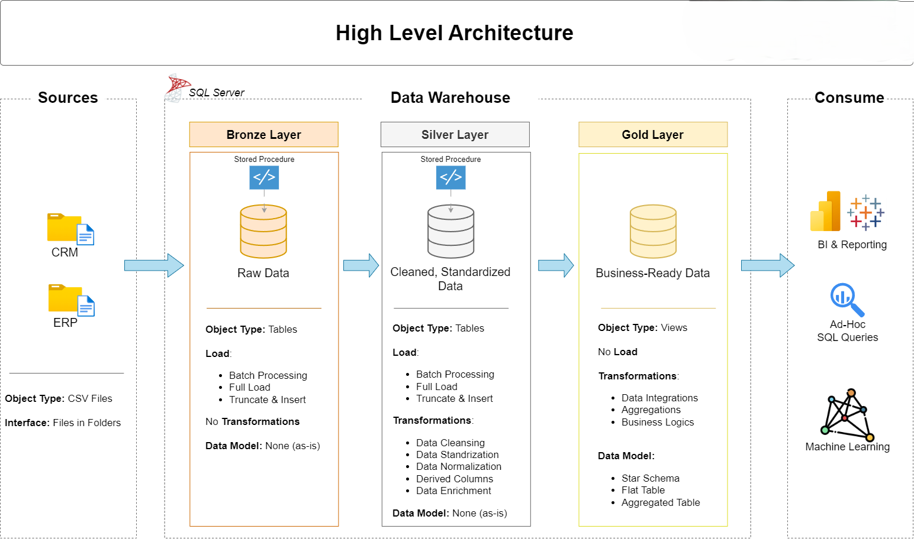

# Data Warehouse and Analytics Project

This repository showcases a complete end-to-end data warehousing and analytics solution, built using modern data engineering best practices. It covers everything from ingesting raw data to designing a robust data warehouse and delivering meaningful business insights.
Developed as a portfolio project, it demonstrates practical skills in data modeling, ETL pipeline design, and structured data processing — aligned with real-world industry standards.

---

## 🧠 SQL Data Analytics Project

In addition to data engineering workflows, this repository also contains a curated set of **SQL scripts** for performing robust **data exploration, analysis, and reporting** within a relational database environment. These reusable templates follow SQL best practices and support:

- 📊 Database profiling and exploration  
- 📈 Calculating key metrics and KPIs  
- 📆 Time-series and trend analysis  
- 📉 Cumulative and rolling aggregations  
- 🧩 Segmentation and cohort analysis  
- 🧠 Business-focused analytical use cases  

These scripts are especially useful for **data analysts** and **BI professionals** to accelerate insights.

---

## 🏗️ Data Architecture

The data architecture for this project follows Medallion Architecture **Bronze**, **Silver**, and **Gold** layers:



1. **Bronze Layer**: Stores raw data as-is from the source systems. Data is ingested from CSV Files into SQL Server Database.  
2. **Silver Layer**: This layer includes data cleansing, standardization, and normalization processes to prepare data for analysis.  
3. **Gold Layer**: Houses business-ready data modeled into a star schema required for reporting and analytics.

---

## 📖 Project Overview

This project involves:

1. **Data Architecture**: Designing a Modern Data Warehouse Using Medallion Architecture **Bronze**, **Silver**, and **Gold** layers.  
2. **ETL Pipelines**: Extracting, transforming, and loading data from source systems into the warehouse.  
3. **Data Modeling**: Developing fact and dimension tables optimized for analytical queries.  
4. **Analytics & Reporting**: Creating SQL-based reports and dashboards for actionable insights.

---

## 🚀 Project Requirements

### Building the Data Warehouse (Data Engineering)

#### Objective  
Develop a modern data warehouse using SQL Server to consolidate sales data, enabling analytical reporting and informed decision-making.

#### Specifications
- **Data Sources**: Import data from two source systems (ERP and CRM) provided as CSV files.  
- **Data Quality**: Cleanse and resolve data quality issues prior to analysis.  
- **Integration**: Combine both sources into a single, user-friendly data model designed for analytical queries.  
- **Scope**: Focus on the latest dataset only; historization of data is not required.  
- **Documentation**: Provide clear documentation of the data model to support both business stakeholders and analytics teams.

---

### BI: Analytics & Reporting (Data Analysis)

#### Objective  
Develop SQL-based analytics to deliver detailed insights into:
- **Customer Behavior**  
- **Product Performance**  
- **Sales Trends**

---

## 📂 Repository Structure

```
data-warehouse-project/
│
├── datasets/                           # Raw datasets used for the project (ERP and CRM data)
│
├── scripts/                            # SQL scripts for ETL and transformations
│   ├── bronze/                         # Scripts for extracting and loading raw data
│   ├── silver/                         # Scripts for cleaning and transforming data
│   ├── gold/                           # Scripts for creating analytical models
│   ├── reports/                        # Scripts for creating reports based on the view
|
├── tests/                              # Test scripts and quality files
│
├── README.md                           # Project overview and instructions
├── .gitignore                          # Files and directories to be ignored by Git
└── requirements.txt                    # Dependencies and requirements for the project
```
---
